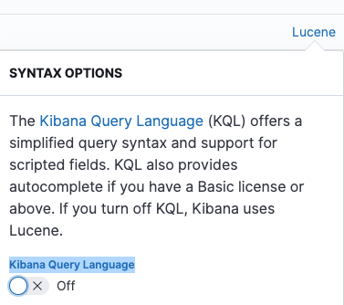
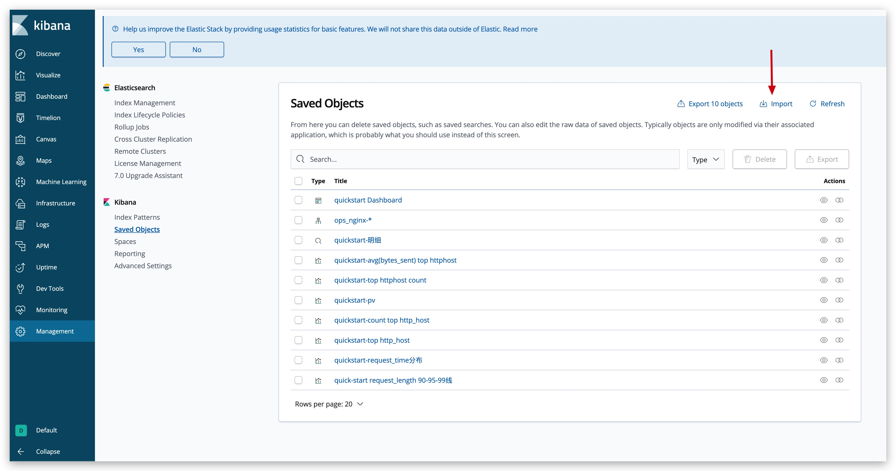
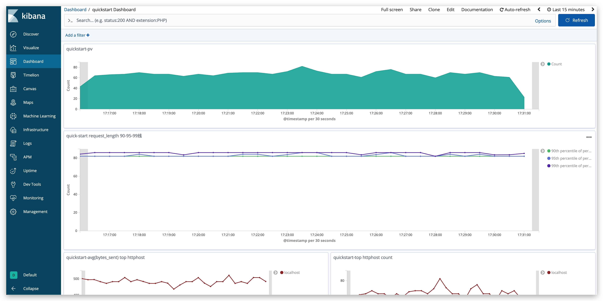

[](https://opensource.org/licenses/Apache-2.0)
[](https://github.com/TongchengOpenSource/ckibana/releases)

**ClickHouse adapter for Kibana**

**ClickHouse proxy for Kibana**

**Clickhouse visualization tool**

#### English | [简体中文](README_cn.md)

---

- [CKibana Best Practices](https://tongchengopensource.github.io/ckibana-docs/en/blog/build-logging-platform-with-native-kibana-and-clickhouse/)
- [kibana-visualization](https://warmdust.github.io/2024/07/20/005/)

## Introduce

CKibana is a service for convenient analysis of ClickHouse data using native Kibana.

A typical use case is when nginx log storage is migrated from ElasticSearch to ClickHouse,users can seamlessly continue their log query and analysis with Kibana.

It is recommended to use version 6.x of Kibana. This version is used internally and has been more thoroughly tested.


## Features

- Version Support: Compatible with ElasticSearch and Kibana versions 6.x, 7.x.
- Syntax Support: Compatible with common ElasticSearch syntax (note: ip_range and date_range can only be queried using the querystring syntax in the search box).
- Sampling Function: For queries with hit results exceeding the threshold, it supports dynamic calculation of sampling and result restoration to improve query performance and ensure that the basic trend of the chart is consistent with the real data trend (the larger the flow control threshold, the closer the real chart trend is).
- Cache Function: Supports using ElasticSearch to cache results to improve the performance of repeated queries.
- Time Round Function: Supports rounding query time, for example, round 20 seconds (example: if the query time is in seconds 0-19, it will automatically round to 0; if it is in seconds 20-39, it will automatically round to 20 seconds, for example, if the query time is from 01:50:15 to 05:52:47, it will automatically adjust to 01:50:00 to 05:52:40). Used in conjunction with the cache function, it can effectively alleviate the pressure on ClickHouse caused by concurrent queries of the same statement by multiple users.
- Blacklist Function: Supports setting a blacklist to prevent complex statements from causing pressure on ClickHouse.
- Query Template Function: Supports syntax monitoring after removing time to facilitate quick problem location. Used in conjunction with the blacklist function, it can effectively ensure the stability of ClickHouse.
- Query Circuit Breaker: Supports advanced features such as configuring the maximum query time range.

#### Supported Aggregation Syntax:

| ES Syntax                  | Note       |
|-----------------------|------------|
| terms                   |            |
| sum                     |            |
| min                     |            |
| max                    |            |
| avg                     |            |
| percentile_ranks         |            |
| percentiles             |            |
| filters                 | Currently, only the first level of aggregation is supported. |
| filter item             |            |
| cardinality             |            |


#### UnSupported  Syntax:
Kibana Query Language(KQL)  is not supported, it is recommended to use the lucene instead。



## Get started
### quick start
To quickly experience Kibana, you can deploy it quickly using docker-compose.

[ckibana-quick-start-doc](https://github.com/TongchengOpenSource/ckibana/blob/main/docker-compose/README.md)

```shell
# Enter the docker-compose directory.
cd ckibana/docker-compose
# Deploy
docker-compose up -d
```
After deployment is complete, access Kibana in a browser at： http://127.0.0.1:5601/

A process with built-in mock data has been included. After importing the Kibana configuration file (dashboard, index-pattern, etc.), you can start experiencing it!

Configuration file path：docker-compose/quickstart-export.json

Effect display：



### Local run CKibana
CKibana can be run on all major operating systems and requires Java JDK version 17 or higher to be installed. To check, please run:`java -version`:

```shell
$ java -version
java version "17.0.5" 
```

The proxy service depends on the **ES, CK, and Kibana services**, which need to be prepared in advance. The following steps only include querying data from CK and do not include writing data to CK.

**1）Create a database and a table**

To initialize database and table structures in ClickHouse, please refer to:[api-docs](https://tongchengopensource.github.io/ckibana-docs/en/api-docs) Detailed explanation of creating a table

**2）Start CKibana**

To modify the ES configuration in CKibana, you need to change it to your own ES information. The configuration file path is `src/main/resources/application.yml`
```yaml
metadata-config:
  hosts: your es metadata cluster hosts
  headers:
    headerKey: yourHeaderValue
```
Package and run or run locally directly `com.ly.ckibana.Bootstrap`
```shell
### start ckibana
$ nohup java -jar ckibana.jar > run.out 2>&1 &

### check whether ckibana is successfully started
$ tail -f ~/logs/app.log
Tomcat started on port(s): 8080 (http) with context path ''
Started Bootstrap in 1.474 seconds
```

**3）start kibana**

Configure the elasticsearchHosts parameter in Kibana to the CKibana proxy address, so that it can be routed to the proxy service.

```shell
eg：elasticsearchHosts=http://ip:port
```

**4）Configure the index pattern whitelist**

Only after configuring the corresponding whitelist can you proceed to create it in the next step `index pattern`，**The configured whitelist needs to be consistent with the table name**，please refer to:[api-docs](https://tongchengopensource.github.io/ckibana-docs/en/api-docs) Update the whitelist index interface

**5）Create `index pattern` in Kibana**

```shell
eg：If the CK table name is `table_test`, then create an index pattern `table_test`
```

After completing the above 5 steps, you can create a dashboard and start using it.

## TODO

- Segmented query: Supports automatically splitting query time, which can fully utilize the cache and improve query performance.

## Documentation
[CKibana-docs](https://tongchengopensource.github.io/ckibana-docs)  

## Contributors

<a href="https://github.com/TongchengOpenSource/ckibana/graphs/contributors"></a>

## Join us
The group supports both Enterprise WeChat and personal WeChat accounts


## HelloGithub计划
<a href="https://hellogithub.com/repository/0bcbf56bab0140c7983ecd57eb3dddde" target="_blank"></a>

## License

[Apache License, Version 2.0](http://www.apache.org/licenses/LICENSE-2.0.html) Copyright (C) Apache Software Foundation

